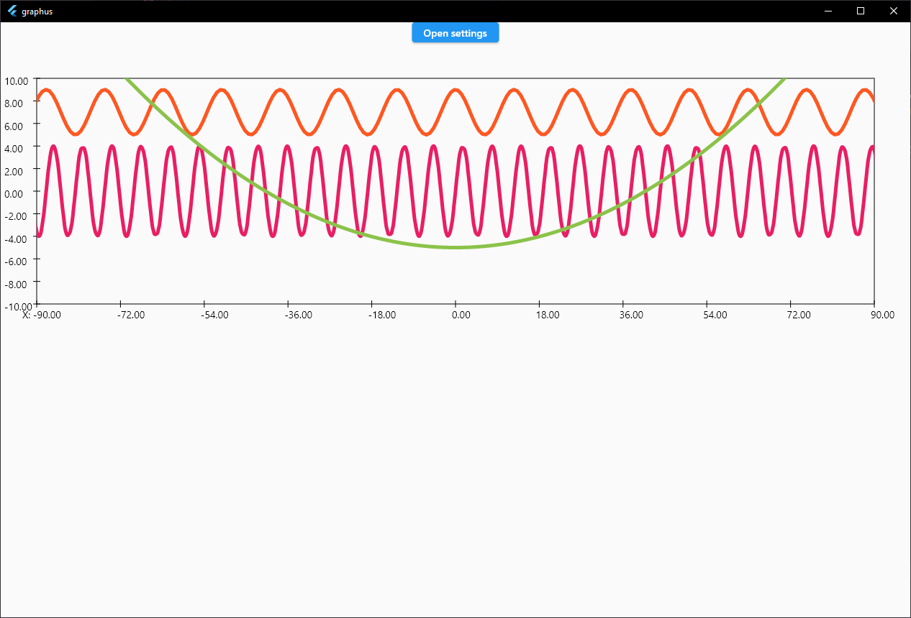
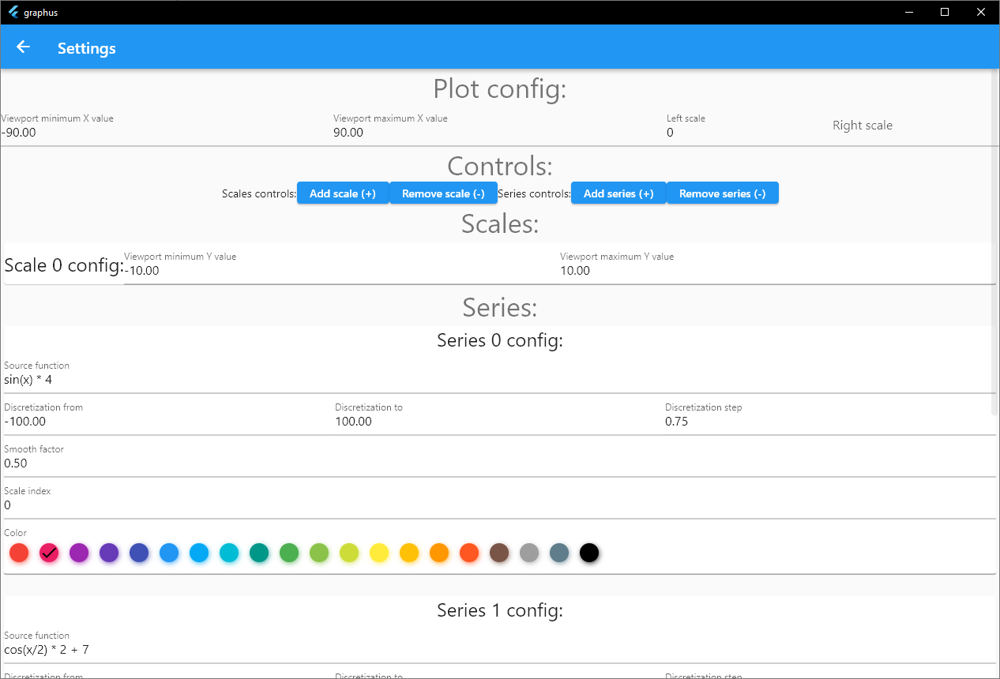

# graphus

Simple chart display with settings screen written in Dart for my coursework.

Requires records and patterns proposal enabled and SDK >=3.0.0-0

* Uses [math_parser](https://pub.dev/packages/math_parser) for function parsing and calculation.
* Uses [reactive_forms](https://pub.dev/packages/reactive_forms) for settings screen.
* Supports function smoothing using [spline interpolation algorithm](http://scaledinnovation.com/analytics/splines/aboutSplines.html) by Rob Spencer.

Whole project is a simple POC rather than a full featured application. Feel free to use it as staring point or open PR if you want to improve it.


## Build

Build for Windows:
```
flutter build windows --release --enable-experiment=records --enable-experiment=patterns
```

Build for Android:
```
flutter build apk --release --enable-experiment=records --enable-experiment=patterns
```

## Screenshots

|  |
| :--:                                        | 
| *Home screen*                               |

|  |
| :--:                                            | 
| *Settings screen*                               |
